# Polynomial Regression Assignment Report

**Name:** Romir Gupta  
**Roll Number:** BT2024195  
**Assignment:** Polynomial Regression

## 1. Summary

Two polynomial regression models were trained for the assigned datasets. The final model for var1 used a degree-5 polynomial expansion with ElasticNet regularization, while the final model for var2 used a degree-10 polynomial expansion with ElasticNet regularization.

| Problem | Selected degree | Final model | 10-fold CV MSE | 10-fold CV R2 |
|---|---:|---|---:|---:|
| var1: Steam turbine optimization | 5 | ElasticNet, alpha = 0.009103, l1_ratio = 1.0 | 0.297031 +/- 0.023987 | 0.971316 +/- 0.004937 |
| var2: Thermal reservoir mapping | 10 | ElasticNet, alpha = 0.000655, l1_ratio = 0.1 | 0.230232 +/- 0.041747 | 0.994225 +/- 0.002097 |

The selected degrees are within the assignment limits and were chosen using 10-fold cross-validation. Final predictions were generated from models fitted on the complete training datasets.

ElasticNet was used on the polynomial feature matrix. The objective minimized was:

`MSE(y, X_poly beta) + alpha * [l1_ratio * ||beta||_1 + (1 - l1_ratio) * ||beta||_2^2 / 2]`

Here, `alpha` controls the overall regularization strength and `l1_ratio` controls the balance between L1 sparsity and L2 shrinkage.

## 2. Data Exploration and Preprocessing

The var1 dataset contains six input variables, `x1` to `x6`, and the var2 dataset contains three input variables, `x1`, `x2`, and `x3`. In both cases, the target variable is `y`.

The input variables in both datasets are already normalized to the range `[-1, 1]`. The target range is wider for var2 than for var1, which is consistent with the higher-degree spatial response expected in the reservoir mapping task.

| Problem | Target mean | Target std | Target min | Target max | Most relevant linear correlations with y |
|---|---:|---:|---:|---:|---|
| var1 | 0.8736 | 3.2708 | -10.7271 | 11.3392 | `x5`: -0.255, `x6`: -0.227 |
| var2 | 2.0807 | 6.6172 | -29.9015 | 32.3655 | `x2`: 0.457, `x3`: 0.190 |

The exploratory plots showed that simple linear relationships were not sufficient, especially for var1 where individual feature-target correlations were weak. This supported the use of polynomial feature expansion to capture nonlinear effects and interactions.

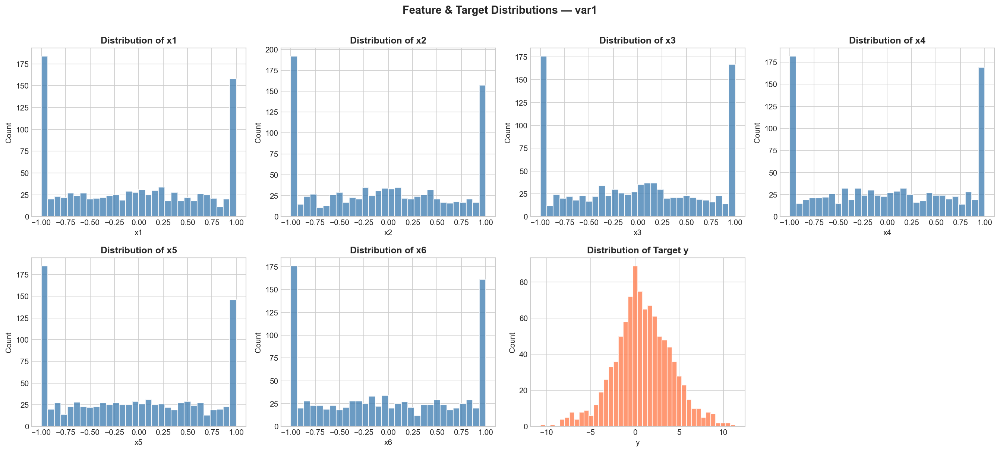

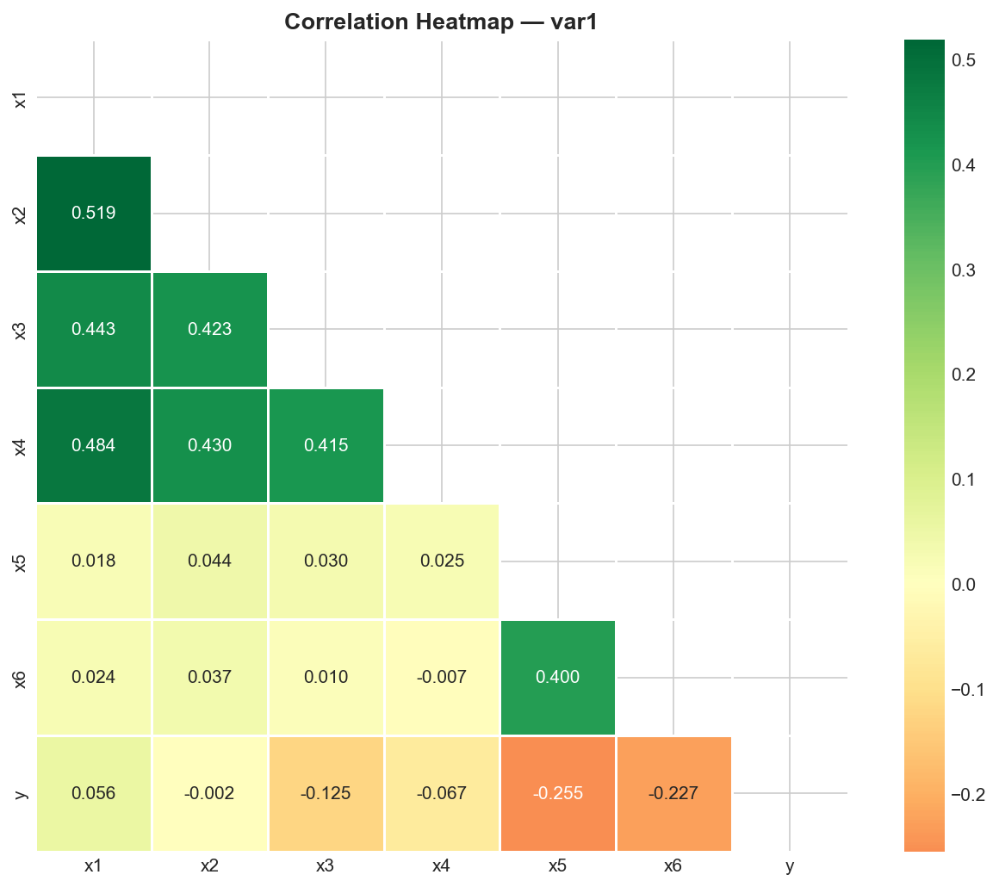

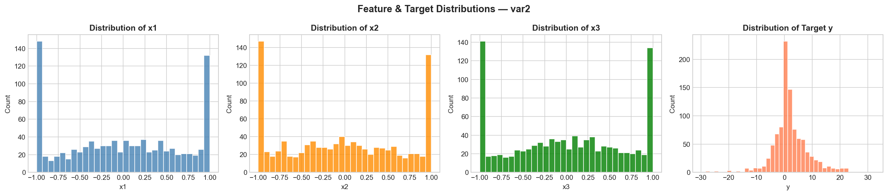

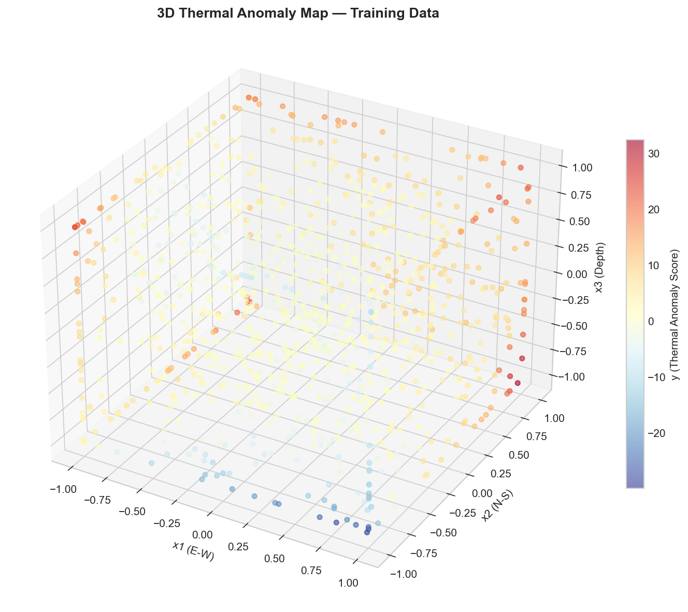

The preprocessing and modeling steps were implemented using scikit-learn pipelines:

1. Generate polynomial features using `PolynomialFeatures(include_bias=False)`.
2. Standardize the expanded feature matrix using `StandardScaler`.
3. Fit a regularized linear regression model on the polynomial feature space.

Using a pipeline is important because scaling is fitted separately inside each cross-validation fold. This prevents information from the validation fold from leaking into the training process.

## 3. Model Selection Approach

The main modeling decisions were the polynomial degree and the regularization strength.

For degree selection, Ridge regression with `alpha=1.0` was used as a stable proxy model. This is useful because polynomial expansion can create many correlated features, especially at high degrees. The degree with the best 10-fold cross-validation performance was selected.

After selecting the degree, ElasticNet was tuned over a grid of `alpha` and `l1_ratio` values. ElasticNet was chosen because it combines:

- L2 regularization, which stabilizes coefficients when polynomial features are correlated.
- L1 regularization, which can remove unnecessary polynomial terms and reduce overfitting.

## 4. Polynomial Degree Selection

### var1

For var1, degrees 1 to 10 were evaluated. Validation error decreased up to degree 5 and then increased for higher degrees. This indicates that degrees above 5 started overfitting the training data. Therefore, degree 5 was selected.

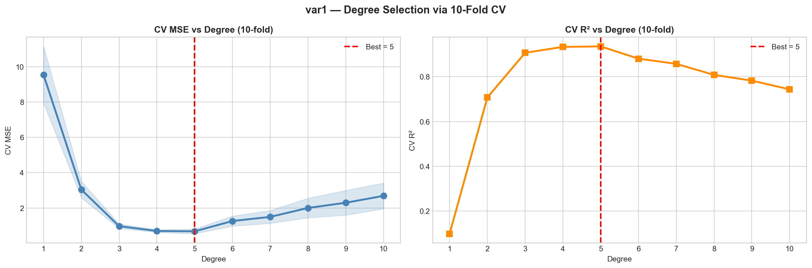

### var2

For var2, degrees 1 to 20 were evaluated. The validation score improved until degree 10, after which the improvement stopped and the error slightly increased. Degree 10 was selected because it gave the best validation performance while avoiding unnecessary higher-degree complexity.

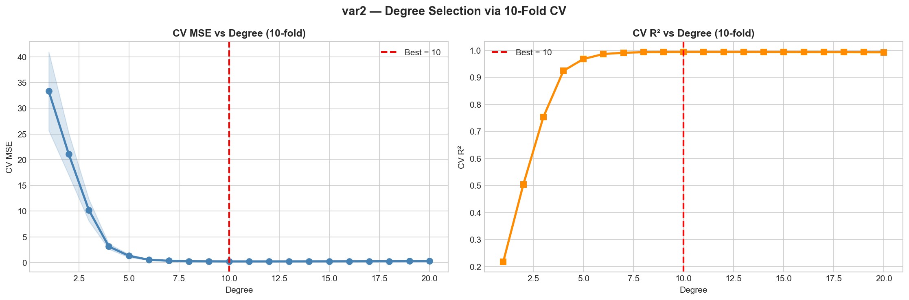

## 5. Final Model Details

### var1 Final Model

| Quantity | Value |
|---|---:|
| Selected polynomial degree | 5 |
| Number of polynomial features | 461 |
| Best alpha | 0.009103 |
| Best l1_ratio | 1.0 |
| Non-zero coefficients | 126 / 461 |
| Training MSE | 0.216335 |
| Training R2 | 0.979757 |
| 10-fold CV MSE | 0.297031 +/- 0.023987 |
| 10-fold CV R2 | 0.971316 +/- 0.004937 |

The selected `l1_ratio` for var1 was 1.0, making the final model Lasso-like. This was appropriate because the degree-5 expansion created 461 polynomial features, but only 126 coefficients remained non-zero. The sparsity helped reduce overfitting by removing weak or unnecessary polynomial terms.

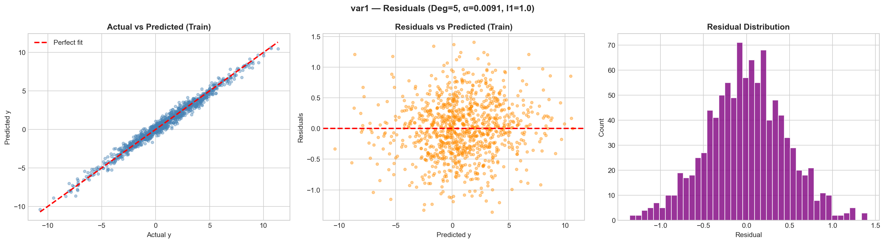

### var2 Final Model

| Quantity | Value |
|---|---:|
| Selected polynomial degree | 10 |
| Number of polynomial features | 285 |
| Best alpha | 0.000655 |
| Best l1_ratio | 0.1 |
| Non-zero coefficients | 253 / 285 |
| Training MSE | 0.162370 |
| Training R2 | 0.996288 |
| 10-fold CV MSE | 0.230232 +/- 0.041747 |
| 10-fold CV R2 | 0.994225 +/- 0.002097 |

The selected `l1_ratio` for var2 was 0.1, so the model used mostly L2 regularization with a small L1 component. This is reasonable for the 3D thermal mapping problem because the target surface appears to depend on many polynomial terms rather than only a small sparse subset.

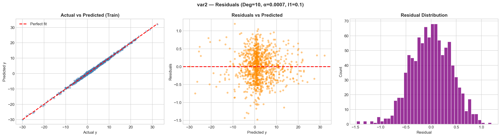

## 6. Diagnostics

The residual plots show that the fitted models track the training targets closely, with residuals centered around zero. The prediction distribution plots compare the training target distribution with the final test prediction distribution and show that the predictions remain in a realistic range.

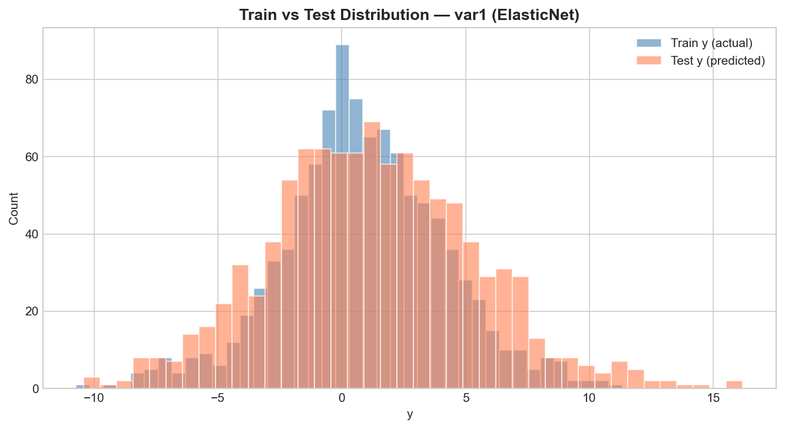

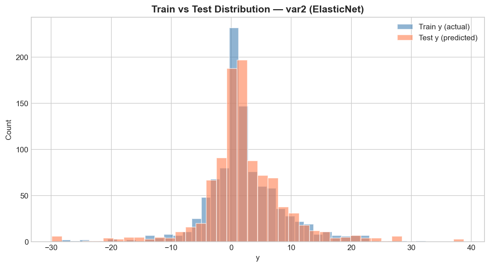

The coefficient sparsity plots further explain the different regularization behavior. var1 is much sparser because the best model uses a Lasso-like penalty, while var2 keeps most polynomial coefficients active because its fitted response is more distributed across the degree-10 feature space.

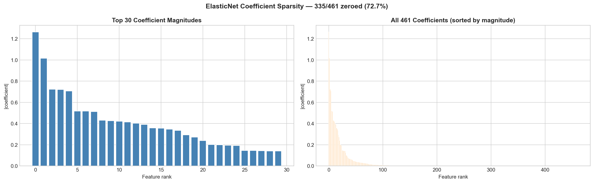

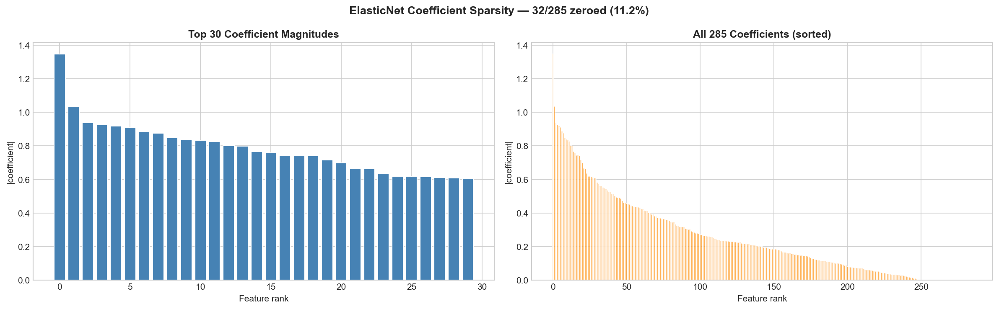

## 7. Conclusion

The final models are polynomial regression pipelines with cross-validated degree selection and ElasticNet regularization. Degree 5 was selected for var1 because it gave the best validation performance before overfitting began. Degree 10 was selected for var2 because it captured the higher-degree spatial structure while maintaining the best cross-validation score.

The final 10-fold CV R2 scores were 0.971316 for var1 and 0.994225 for var2. The two prediction CSV files were generated from the final fitted pipelines for assignment submission.

